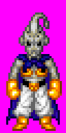

# Fralacticus Chercheur Image

Ce programme permet d'extraire toutes les images (sprites et background) du jeu DBZ Buu's Fury au format bitmap indexé avec les bonnes palettes.

# Préparation

Système d'exploitation : Windows 10 ou supérieur

Espace disque libre nécessaire : 150 mo

## Installation

1. Installer le sdk de Dart (version minimale 2.17.3) et l'ajouter aux variables d'environnements : [Get the Dart SDK | Dart](https://dart.dev/get-dart)

2. Ouvrir une console de commandes à la racine du projet

3. Entrer la commande : `dart pub get`

## Placement de la rom du jeu

La rom doit être placée dans le dossier existant **./Sources** avec le nom **buus_fury.gba**

# Exécution et utilisation

## Lancement

1. Ouvrir une console de commandes à la racine du projet

2. Entrer la commande : `dart run ./bin/main.dart ./Sources/buus_fury.gba`

## Utilisation

Pour obtenir toutes les images du jeu, il faut lancer dans l'ordre les 3 opérations du menu :  

- Chercher les adresses et leurs pointeurs

- Décompresser les images

- Créer les bitmap

Entre chaque opération, il est possible d'attendre ou fermer le programme sans devoir relancer les opérations précécentes déjà terminées.

En cas de problème ou interruption pendant le déroulement d'une opération, il suffit de la relancer sans suppression manuelle d'un quelconque fichier généré.

## Exploitation des résultats

### Organisation et nommage

Les images sont extraites le dossier **Images** et réparties dans des sous-dossiers selon leurs dimensions en pixels. 

Les fichiers sont nommés selon la structure décrite dans le tableau suivant.

Exemple : ./Images/2048/sprite-dim_2048(32x64)-i_3884-adr_3fe8c4.bmp

| Type   | Dimension | Ratio Largeur x Hauteur | Index fictif | Adresse dans la rom |
| ------ | --------- | ----------------------- | ------------ | ------------------- |
| sprite | 2048      | 32 x 64                 | 3884         | 03fe8c4             |

### Analyse

Dans la rom seule l'information de dimension totale est indiquée, donc chaque image est reconstruite en autant d'exemplaires que de ratio largeur x hauteur possibles pour cette dimension. 
Or pour chaque image un seul ratio est correct et il faut le trouver visuellement.

Analyse d'une image dans le dossier **./Images/2048** :

| Nom           | sprite-dim_2048(32x64)-i_3884-adr_3fe8c4.bmp             | sprite-dim_2048(64x32)-i_3884-adr_3fe8c4.bmp             |
| ------------- | -------------------------------------------------------- | -------------------------------------------------------- |
| **Visuel**    |  |  |
| **Correct ?** | ***OUI***                                                | NON                                                      |

Pour information, ci-dessous les tables de ratio utilisées :

**Sprite**

| shape / size | small | normal | big   | huge  |
| ------------ | ----- | ------ | ----- | ----- |
| square       | 8x8   | 16x16  | 32x32 | 64x64 |
| wide         | 16x8  | 32x8   | 32x16 | 64x32 |
| tall         | 8x16  | 8x32   | 16x32 | 32x64 |

**Background**

| shape /size | small   | normal  | big     | huge      |
| ----------- | ------- | ------- | ------- | --------- |
| square      | 128x128 | 256x256 | 512x512 | 1024x1024 |
| wide        |         |         | 512x256 |           |
| tall        |         |         | 256x512 |           |

> Remarque : Il y a une image exceptionnelle dans le dossier 15424 qui n'a pas une dimension standard